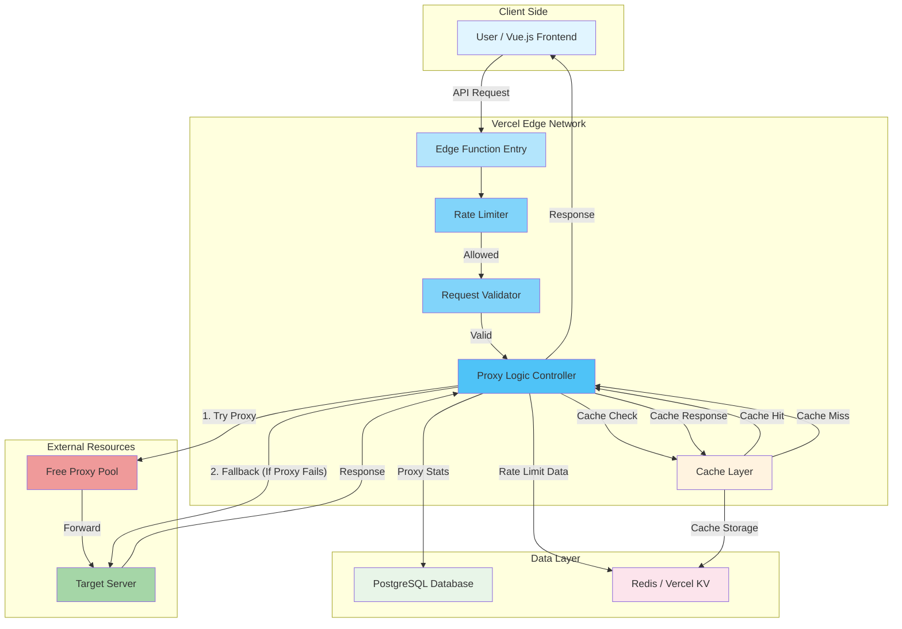

# 🏗️ xRelay Architecture Design

### Technical Architecture & Design Decisions

[🏠 Home](./README.md) • [🔧 API Docs](./README.md#api-文档)

---

## 📋 Table of Contents

- [Overview](#overview)
- [System Architecture](#system-architecture)
- [Component Design](#component-design)
- [Data Flow](#data-flow)
- [Design Decisions](#design-decisions)
- [Technology Stack](#technology-stack)
- [Security Architecture](#security-architecture)

---

## Overview

### 🎯 Architecture Goals

<table>
<tr>
<td width="25%" align="center">
 
<b>Performance</b> 
Vercel Edge Functions
</td>
<td width="25%" align="center">
 
<b>Reliability</b> 
Smart Fallback Mechanism
</td>
<td width="25%" align="center">
 
<b>Anonymity</b> 
Dynamic Proxy Pool
</td>
<td width="25%" align="center">
 
<b>Protection</b> 
Rate Limiting
</td>
</tr>
</table>

### Design Principles

> 🎯 **Simplicity**: Minimalist codebase leveraging Vercel's infrastructure.
>
> 🔄 **Resilience**: Always ensure the request succeeds, either via proxy or direct fallback.
>
> ⚡ **Edge First**: Execute logic close to the user for minimal latency.

---

## System Architecture

### 🏛️ High-Level Architecture

---

## Component Design

### 1️⃣ Edge Function Entry (`api/index.ts`)

The entry point for all requests. It runs on Vercel's Edge Runtime, ensuring low latency and high availability.

- **Responsibilities**:
  - Request parsing and validation
  - API Key authentication
  - Rate limiting checks
  - Response formatting
  - Error handling

### 2️⃣ Database Layer (`lib/database/`)

Manages proxy data persistence and state across multiple deployment instances.

- **Components**:
  - `connection.ts`: Database connection management
  - `available-proxies-dao.ts`: Active proxy operations
  - `deprecated-proxies-dao.ts`: Failed proxy tracking
  - `cleanup.ts`: Automated maintenance tasks

### 3️⃣ Cache Layer (`api/cache.ts`)

Provides response caching to reduce redundant requests and improve performance.

- **Storage**: Redis or Vercel KV
- **TTL**: 5 minutes (configurable)
- **Strategy**: Cache-aside pattern

### 4️⃣ Proxy Manager

Manages the lifecycle of proxy selection and usage.

- **Strategy**: Fetches proxies from a curated list of free proxy providers.
- **Validation**: Checks if a proxy is alive before using it (optimistic or pre-check).
- **Rotation**: Selects multiple proxies for each request to maximize success rate.

### 5️⃣ Security Layer (`api/security.ts`)

Ensures secure operation and prevents abuse.

- **SSRF Protection**: Blocks internal network access
- **IP Validation**: Validates client IP addresses
- **Header Sanitization**: Removes sensitive headers

### 6️⃣ Fallback Mechanism

Ensures high success rates.

- **Trigger**: Network timeout, connection refused, or HTTP 5xx from proxy.
- **Action**: Retries the request directly from the Vercel Edge node.
- **Transparency**: Returns metadata indicating if fallback was used.

---

## Data Flow

1.  **Incoming Request**: Client sends a POST request with `url`, `method`, and `headers`.
2.  **Validation**: System checks for required fields and validates headers.
3.  **Rate Limit Check**: Checks if the IP or global rate limit has been exceeded.
4.  **Proxy Attempt**:
    - Select a proxy from the pool.
    - Forward request via proxy.
    - If successful, return response.
5.  **Fallback (On Failure)**:
    - Log proxy failure.
    - Directly fetch the target URL from Vercel Edge.
6.  **Response**: Return the data to the client with execution metadata.

---

## Design Decisions

### Why Vercel Edge Functions?

- **Global Distribution**: Code runs close to the user.
- **No Cold Starts**: Faster than traditional serverless functions.
- **Cost Effective**: Generous free tier for hobbyist projects.

### Why Fallback to Direct?

- Free proxies are unreliable.
- The primary goal is to **get the data**.
- Direct Vercel requests hide the client's IP, which is often sufficient privacy.

---

## Technology Stack

- **Runtime**: Node.js / Vercel Edge Runtime
- **Language**: TypeScript
- **Frontend Framework**: Vue.js 3
- **Build Tool**: Vite
- **Database**: PostgreSQL (with @vercel/postgres)
- **Cache**: Redis / Vercel KV
- **HTTP Client**: Undici
- **Testing**: Vitest
- **Deployment**: Vercel / Docker

---

## Security Architecture

- **IP Hiding**: The target server sees the Proxy IP or Vercel's IP, never the User's IP.
- **Rate Limiting**:
  - **Global**: Protects against system-wide abuse.
  - **Per IP**: Prevents individual users from hogging resources.
- **Header Sanitization**: Removes sensitive headers before forwarding.
