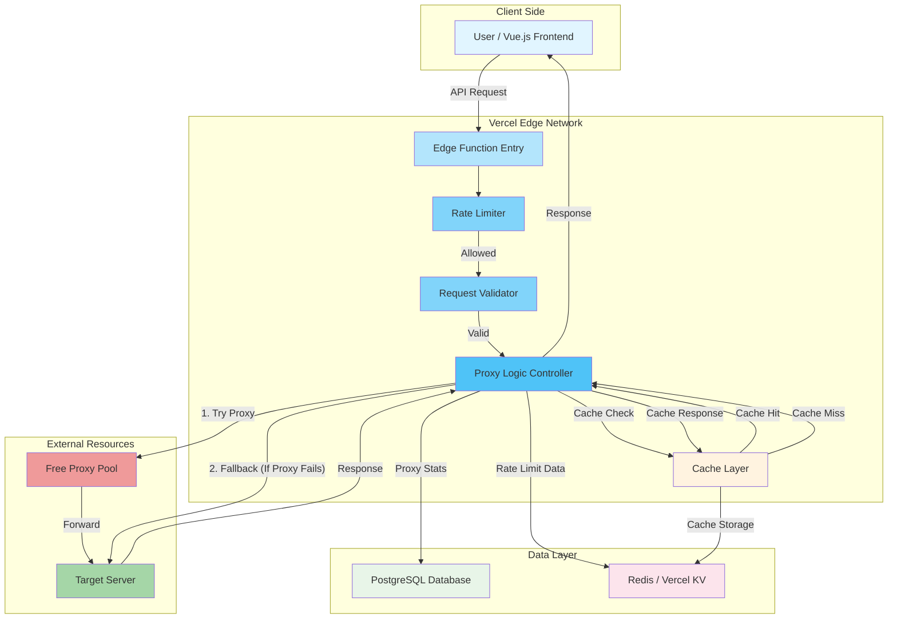

# 🏗️ xRelay Architecture Design

### Technical Architecture & Design Decisions

[🏠 Home](./README.md) • [🔧 API Docs](./README.md#api-文档)

---

## 📋 Table of Contents

- [Overview](#overview)
- [System Architecture](#system-architecture)
- [Component Design](#component-design)
- [Data Flow](#data-flow)
- [Design Decisions](#design-decisions)
- [Technology Stack](#technology-stack)
- [Security Architecture](#security-architecture)

---

## Overview

### 🎯 Architecture Goals

<table>
<tr>
<td width="25%" align="center">
 
<b>Performance</b> 
Vercel Edge Functions
</td>
<td width="25%" align="center">
 
<b>Reliability</b> 
Smart Fallback Mechanism
</td>
<td width="25%" align="center">
 
<b>Anonymity</b> 
Dynamic Proxy Pool
</td>
<td width="25%" align="center">
 
<b>Protection</b> 
Rate Limiting
</td>
</tr>
</table>

### Design Principles

> 🎯 **Simplicity**: Minimalist codebase leveraging Vercel's infrastructure.
>
> 🔄 **Resilience**: Always ensure the request succeeds, either via proxy or direct fallback.
>
> ⚡ **Edge First**: Execute logic close to the user for minimal latency.

---

## System Architecture

### 🏛️ High-Level Architecture

```mermaid
graph TB
    subgraph "Client Side"
        A[User / Vue.js Frontend]
    end

    subgraph "Vercel Edge Network"
        B[Edge Function Entry]
        C[Rate Limiter]
        D[Request Validator]
        E[Proxy Logic Controller]
        F[Cache Layer]
    end

    subgraph "Data Layer"
        G[PostgreSQL Database]
        H[Redis / Vercel KV]
    end

    subgraph "External Resources"
        I[Free Proxy Pool]
        J[Target Server]
    end

    A -- API Request --> B
    B --> C
    C -- Allowed --> D
    D -- Valid --> E

    E -- Cache Check --> F
    F -- Cache Hit --> E
    F -- Cache Miss --> E

    E -- Proxy Stats --> G
    E -- Rate Limit Data --> H
    F -- Cache Storage --> H

    E -- 1. Try Proxy --> I
    I -- Forward --> J

    E -- 2. Fallback (If Proxy Fails) --> J

    J -- Response --> E
    E -- Cache Response --> F
    E -- Response --> A

    style A fill:#e1f5ff
    style B fill:#b3e5fc
    style C fill:#81d4fa
    style D fill:#81d4fa
    style E fill:#4fc3f7
    style F fill:#fff3e0
    style G fill:#e8f5e8
    style H fill:#fce4ec
    style I fill:#ef9a9a
    style J fill:#a5d6a7
```

---

## Component Design

### 1️⃣ Edge Function Entry (`api/index.ts`)

Vercel IO 适配层，将 `VercelRequest/VercelResponse` 适配到共享核心处理器 `dispatchRequest`。实际的业务逻辑（路由、限流、认证、代理执行）统一位于 `src/server/handlers.ts`。

- **Responsibilities**:
  - 构造运行时中立的 `RequestContext`
  - 调用 `dispatchRequest` 处理业务
  - 将 `ResponseSpec` 应用到 `VercelResponse`

### 2️⃣ Database Layer (`src/database/`)

Manages proxy data persistence and state across multiple deployment instances.

- **Components**:
  - `connection.ts`: Database connection management
  - `available-proxies-dao.ts`: Active proxy operations
  - `deprecated-proxies-dao.ts`: Failed proxy tracking
  - `cleanup.ts`: Automated maintenance tasks

### 3️⃣ Cache Layer (`src/cache/`)

Provides response caching to reduce redundant requests and improve performance.

- **Storage**: In-memory LRU cache (`advanced-cache.ts`)
- **TTL**: 5 minutes (configurable via `CACHE_CONFIG.ttl`)
- **Max Size**: 100 entries (configurable via `CACHE_CONFIG.maxSize`)
- **Strategy**: Cache-aside pattern (仅缓存 GET 请求)
- **Note**: 仅对成功响应的 GET 请求写缓存。单实例缓存，跨实例场景需通过 Vercel KV 或 Redis 实现。

### 4️⃣ Proxy Service (`src/core/proxy-service.ts`)

Manages the lifecycle of proxy selection and usage.

- **Strategy**: Fetches proxies from multiple free proxy providers
- **Multi-Proxy Racing**: Selects 5 proxies per request and races them in parallel
- **Fallback**: Automatically falls back to direct connection if all proxies fail

### 5️⃣ Security Layer (`src/security/`)

Ensures secure operation and prevents abuse.

- **SSRF Protection**: Blocks internal network access and DNS rebinding attacks
- **IP Validation**: Validates client IP addresses
- **Header Sanitization**: Removes sensitive headers
- **API Key Authentication**: Optional API Key validation for production

### 6️⃣ Fallback Mechanism

Ensures high success rates.

- **Trigger**: Network timeout, connection refused, or HTTP 5xx from proxy.
- **Action**: Retries the request directly from the Vercel Edge node.
- **Transparency**: Returns metadata indicating if fallback was used.

### 7️⃣ Middleware Layer (`src/middleware/`)

Provides request processing pipeline.实际的路由分发、CORS、认证在 `src/server/handlers.ts` 中统一处理。

- **Components**:
  - `rate-limit.ts`: 限流（内存滑动窗口，按端点/IP 隔离）
  - `auth.ts`: API Key 验证（支持 VercelRequest 与标准 Headers）
  - `types.ts`: 中间件类型定义

### 8️⃣ Webpage Capture (`src/webpage-capture/`)

Provides webpage capture capabilities.

- **Modes**: HTML, Screenshot, Article extraction
- **Browser Pool**: Manages browser instances for rendering
- **Article Extractor**: Extracts clean article content from webpages
- **Resource Processor**: Processes and inlines resources (CSS, images)
- **Stealth Scripts**: Anti-detection scripts for headless browser

---

## Data Flow

1.  **Incoming Request**: Client sends a POST request with `url`, `method`, and `headers`.
2.  **Validation**: System checks for required fields and validates headers.
3.  **Rate Limit Check**: Checks if the IP or global rate limit has been exceeded.
4.  **Proxy Attempt**:
    - Select a proxy from the pool.
    - Forward request via proxy.
    - If successful, return response.
5.  **Fallback (On Failure)**:
    - Log proxy failure.
    - Directly fetch the target URL from Vercel Edge.
6.  **Response**: Return the data to the client with execution metadata.

---

## Design Decisions

### Why Vercel Edge Functions?

- **Global Distribution**: Code runs close to the user.
- **No Cold Starts**: Faster than traditional serverless functions.
- **Cost Effective**: Generous free tier for hobbyist projects.

### Why Fallback to Direct?

- Free proxies are unreliable.
- The primary goal is to **get the data**.
- Direct Vercel requests hide the client's IP, which is often sufficient privacy.

---

## Technology Stack

- **Runtime**: Node.js / Vercel Edge Runtime
- **Language**: TypeScript
- **Frontend Framework**: Vue.js 3
- **Build Tool**: Vite
- **Database**: PostgreSQL (with @vercel/postgres)
- **Cache**: Redis / Vercel KV
- **HTTP Client**: Undici
- **Testing**: Vitest
- **Deployment**: Vercel / Docker

---

## Security Architecture

- **IP Hiding**: The target server sees the Proxy IP or Vercel's IP, never the User's IP.
- **Rate Limiting**:
  - **Global**: Protects against system-wide abuse.
  - **Per IP**: Prevents individual users from hogging resources.
- **Header Sanitization**: Removes sensitive headers before forwarding.
